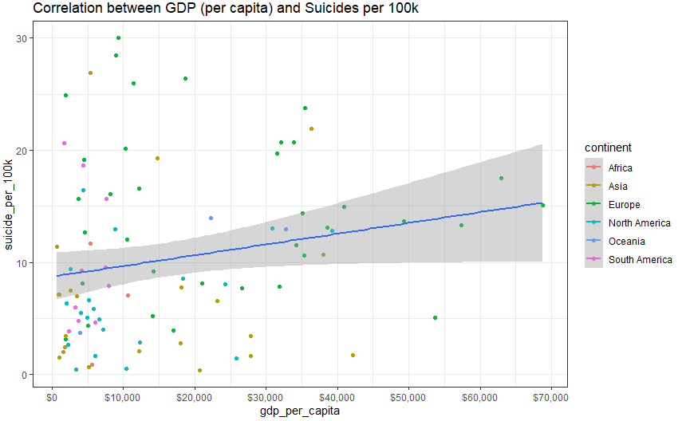
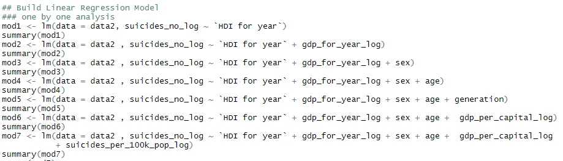

# Section 1: Introduction
Suicide has long been regarded as a serious public safety problem. According to the report of World Health Organization (WHO), about 800,000 people die of suicide every year, and the number of attempted suicides is much higher. The report also points out that the suicide phenomenon has a youth-oriented tendency that it has become the second leading cause of death after traffic accidents among teenagers. Faced with this trend, WHO has appealed to countries to take notice and carry out measures to prevent suicides.

According to the article reported by the Economist in 2018, global suicide rates have fallen by 29% since 2000, thanks to urbanization and government policies. The United States, however, is the exception with the figure rising by 18%. The differences in suicide rates among countries may owe to diverse demographic characteristics and economic factors. One of the tasks in the project is to visualize the differences.

Although the suicide rate shows different tendencies among countries, as we concerned, it always shows similar patterns in all the countries. We believe that in most countries of the world, older people are more likely to commit suicides than youngsters, and men are more likely to commit suicide than women. What we need to do is to verify and confirm the pattern by doing statistical analysis.

In a word, it is helpful to understand the changes in suicide mortality rates among countries and generations, so effective suicide prevention strategies can be developed for vulnerable populations.

In this project, we use the suicides dataset provided by Kaggle to analyse the pattern and trends of suicides in different countries. The dataset contains global, regional and 195-country suicide mortality patterns from 1985 to 2016 in the form of age, gender, demographic and economic indicators, etc. We will analyse the global suicide rates throughout the period and discover the differences among countries and continents. The project aims to explore the relationship between suicide rates and age groups, gender, countries, continents, and GDP.

We mainly apply R programming to derive statistics and plot the relationships between factors. Then we use Shiny to interactively show the results. We want to draw inspiration from the analysis of suicide rates to make the public pay attention to personal mental health and take action to reduce the occurrence of suicides.

# Section 2: Overall Concept
Our study aims to explore the suicides pattern from the year 1985 to the year 2016 through global, continent and country scales, as well as gender, age, GDP and generation factors. The descriptive exploration obtained will then be verified through statistical inferential analysis. We set the target audience as World Health Organization officer who are concerned to track the trend and factors associated with suicides, as we wish the analysis will provide insights and inspire necessary actions taken on suicides prevention.

Problems we want to identify may include and not limited to:

- What is the geographical distribution for suicides if we search by continents? What if by countries?
- What is the suicides trend according to year?
- Are men far more prone to committing suicide than women?
- Are young people or old people more likely to commit suicide?

These problems are brought up and we will proceed with the analysis following the model below.

# Section 3: Data Sources
The dataset we use is Suicide Rates Overview 1985 to 2015 dataset from Kaggle1.
The dataset has 12 attributes, being:

The variables we use are: Country, Year, Sex, Age, Suicides no, population, GDP Per capita, and generation. We recode country as some of the country names are wrong or not standardized and use it to add a new column named Continent based on country. We reclassify countries that have been coded as 'Americas' into 'North America' and 'South America'.

We developed an interactive dashboard for demo purpose, providing a user-friendly window that the user can filter data as he/she wants. Our shiny app consists of four modules:

- Data Overview – Allow the user to filter out suicides socio-economic data table based on country, year and age. The data extracted can be examined by search function and can be sorted by different variables.
- Country Trend – Allow the user to visualize suicides trend by a specific country.
- Descriptive Analysis – Interactive dashboard with bar chart, pie chart and line graph are included in the demo to how suicide rate is related to each factor.
- Inferential Analysis – Confidence Interval and Linear Regression techniques are applied.

An example of the app may look like the picture below:

# Section 4: Specific Methodology
## Methodology
Employed R packages:
- dplyr: A grammar of data manipulation. It’s useful for more efficient data cleansing, data analysis.
- tidyverse: It’s useful for data analysis processing and visualizing.
-ggalt: A compendium of new geometries, coordinate systems, statistical transformations, scales and fonts for ggplot2.
- countrycode: Standardize country names, convert them into one of eleven coding schemes, convert between coding schemes, and assign region descriptors.
- rworldmap: Enables mapping of country level and gridded user datasets.
- gridExtra: Provides a number of user-level functions to work with grid graphics, notably to arrange multiple grid-based plots on a page and draw tables.
- broom: Summarizes key information about statistical objects in tidy tibbles.
- readxl: Import excel files into R.
- DT: Data objects in R can be rendered as HTML tables using the JavaScript library 'DataTables' (typically via R Shiny).
- Highcharter: Shortcut functions to plot R objects and offer numerous interactive chart types with a simple configuration syntax.
- Viridis: Set better color maps and browsers.
- ggplot2: A great and popular graphic creating module.
- Shiny & shinydashboard : Make users to build interactive web applications easily with R. Automatic "reactive" binding between inputs and outputs and extensive prebuilt widgets make it possible to build beautiful, responsive, and powerful applications with minimal effort.

## Data Preparation
After importing the data to RStudio, firstly we amended names of columns and some countries to a standardized format.

Besides, we removed rows for year 2016 because of the shortage of valid data. And countries “Dominica” and “Saint Kitts and Nevis” with too much missing values also have been removed.

Meanwhile, column “HDI.for.year” has been also excluded due to the extremely large amount of missing values existed.

We employed “countrycode” package in RStudio to match various countries with the continent that they belong to. As a result, a new column named “continent” has been established.

GDP per capital has been graded and classified into five groups, generating a new column called “gdp_per_capita_grade”.

Lastly, we designed and customized a theme including color, font size and layout for the data visualization.

## Descriptive Analysis
In general, we intend to analyze data from three main scales: worldwide, continent and country.
### Worldwide
Firstly, we grouped data by years, gender and age and drawn interactive graphs by using “Highcharter” package to display the overall trend that how the number of suicides would change with time. As figure shows below, it reached a peak in 1995 that there were about 15 people out of every 100k to choose ending their lives.

Besides, we can notice that the suicides number of males had always outnumbered that of females. It accounted for about 77.7% of the total suicides number from 1985 to 2015 and increased sharply since 1988.

It is extremely necessary to mention that people above age 75 had stronger intention to commit suicide than others. They nearly made up ¼ of the total suicides. But fortunately, it seems like the suicides number of them had experienced a smooth decrease from 1900 to 2015.

### Continent
In this section, we are still trying to figure out that how the number of suicides would change with time for different gender and age but based on the continental classification.

Generally, people in Europe are more prone to commit suicide. As graphs indicate below, the average number of suicides in Europe from 1985 to 2015, about 18.09 per 100k population which accounted for 28.8%, ranked number one around the world. On the other hand, we can observe that the suicides number in Africa experienced a sharp rise from 1986 and significantly drop from 1995. It will be very beneficial for the prevention actions’ formulation and application if factors that caused such shifts can be identified.

As we expected, the proportion of suicide number for gender and age holds still in different continent - males and elders were much more inclined to commit suicide.

### Country
Lastly, we are going to discover the number of suicides in each country. Based on the figures, we can notice that Lithuania, Russia and Sri Lanka ranked top three for having the highest average number of suicides. And it can also be observed directly through the map below. Blank regions are caused by the shortage of data for certain countries.

## Inferential Analysis
### Simple Linear Regression Model
In this part, two linear regression models have been created to discover the relationship between the number of suicides, GDP per capital and population by implementing the “lm” function in R. Extreme values has been excluded for more accurate results.

According to the summary report, we can conclude that the number of suicides had a strong positive correlation with the GDP per capital and population, due to the extremely low p-values (both <0.05). Consequently, we can predict the future suicides number based on the coefficients that these two models generated.

### Multivariate Linear Regression Model
We do multivariate regression analysis to find out which variables affect the number of suicides. Before doing regression analysis, it is essential to transform skewed variables to be normally distributed and select useful variables to build model.

After transformation, we include independent variables to regression model by using “lm” function one by one to see the variation between the number of suicides and dependent variables. The result shows that with more variables included in the model, the adjusted R Squared gets larger. The model includes all the independent variables is the best fit model with the largest adjusted R Squared of 0.9149, meaning these variables can explain 92.49% of the variation of the suicides number. The ANOVA also shows that these variables have significant predictive power to the suicides number. The stepwise regression selects the same variables as the former analysis.

We use “summary(lm.beta())” function to see which variables have the greatest significance to the model. The result shows “gdp for year” has the greatest predictive power, followed by “suicides per 100k”, “gdp per capital” and so on. From the coefficients, we can interpret that the number of suicides increases with GDP value while decreases with GDP per capita.

### Confidence Interval
Last but not least, we intend to construct a confidence interval as an estimate of the mean suicides number for different continent and generation stated as a range with a lower and upper limit and a specific degree of certainty which is 95%. Although the true mean suicides numbers may or may not be in this interval, 95% of intervals formed in this manner will contain the true means.

### ANOVA
In this part, analysis of variance (ANOVA) has been performed to compare multiple means of suicides number for various generations and graded GDP per capital and evaluate whether the difference between them is significant or not.

- Null Hypothesis: All population means are equal
- Alternate Hypothesis: At least one population mean is different

By implementing the “aov” function, we can conclude that the null hypotheses are rejected and we have sufficient evidence to support the claim that there are significant differences between the groups generation and between the groups graded GDP, due to the very low p-values (<0.005).

## Shiny
In the Shiny dashboard, there are four different blocks. “Data Overview” allows the user to filter out the raw data by selecting country, year and age. This block also supports keyword search. In “Country Trend” block, the user can generate different trendlines of deaths numbers, by simply selecting different countries and time periods. A dropdown list and a sliding number axis are introduced in this sector. “Exploratory Analysis” allows the user to generally understand our analytic framework. We even dye a world map in different colours to show the death number density of different countries. The last sector of “Inferential Analysis” shows the result of linear regression and confidence level.

# Section 5: Summary
Suicide, as an act of intentionally causing one's own death, has become the 10th leading casue to death worldwide. In this project, we import a dataset of worldwide suicide rates from 1985 to 2016 from Kaggle and try to explore the patterns behind rows and columns. After analysis, we also build an R Shiny dashboard to better depict out result.

We first make a descriptive analysis using R. Through line chart, histogram, data table, pie chart and so forth, we illustrate the statistical parameters of suicide rates worldwide, grouped by years, genders, ages, countries and continents.

Globally, the suicide rate has been decreasing in the 30 years. The suicide rate trendline reaches a peak in 1995 and then shows a steady decreasing till now. In the histogram grouped by continents, Europe ranks the first and Asia as the second. However, the curve indicates that Europe, Asia and Africa are having fewer and fewer people who commit suicide in recent years, while the situation in Oceania and Americas is rather concerning.

As to sex and age, older groups have higher rates than younger ones, which is true throughout one’s life. The suicide rate of those aged 75+ has dropped by more than 50% since 1990 and the suicide rate in the ‘5-14’ category remains roughly static and small (< 1 per 100k per year). Men are about three times more likely to commit suicide than women. Although the absolute values are distinctive, the patterns of the both groups are similar. This means suicide rate is more likely to show a figure on a social level instead of within gender groups or age groups.

We also picture the bar chart of the suicide rate of each country. It shows Lithuania’s rate has been highest by a large margin. Also, there is a large overrepresentation of European countries with high rates, few with low rates, which is consistent with our former conclusion.

Besides descriptive exploration, we also conduct inferential analysis on the dataset. The regression model between rates and GDPs shows a weak positive relationship – richer the country is, more people are likely to end his or her life. In the assumption of normal distribution, we give out the confidence interval of the mean deaths of different generations and continents.

In conclusion, it is happy to see a decrement of the suicide rate in the last 30 years as well as the dropping trend still exists. Nevertheless, the result that older people tend to commit suicide than teenagers and middle-aged people do astonish us. We might think that the elderly has less stress and more leisure time, but the fact is that they are the ones that the society often ignore. With the aging problem becoming more and more serios, it is vital to build a more comprehensive system to take care of the elderly’s mental healthiness. What’s more, despite the dropping of total numbers, the ratio between men and women remains at a level of 3 throughout the 30 years. Under such circumstance, we strongly suggest boys go for a psychologist should he have depression, anxiety or other uncontrollable disorders.
